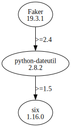

# Third Party Dependencies

<!--[[[fill sbom_sha256()]]]-->
The [SBOM in CycloneDX v1.4 JSON format](https://git.sr.ht/~sthagen/nineties/blob/default/etc/sbom/cdx.json) with SHA256 checksum ([8b569918 ...](https://git.sr.ht/~sthagen/nineties/blob/default/etc/sbom/cdx.json.sha256 "sha256:8b569918fa12279d41c976af07cfc9cc4d31bafcf9616b2471b7f5e2c54b45ce")).
<!--[[[end]]] (checksum: 13de6f8ec6ab13b2e1e255149a0a7f0c)-->
## Licenses 

JSON files with complete license info of: [direct dependencies](direct-dependency-licenses.json) | [all dependencies](all-dependency-licenses.json)

### Direct Dependencies

<!--[[[fill direct_dependencies_table()]]]-->
| Name                                     | Version                                          | License     | Author | Description (from packaging data)                           |
|:-----------------------------------------|:-------------------------------------------------|:------------|:-------|:------------------------------------------------------------|
| [Faker](https://github.com/joke2k/faker) | [19.6.1](https://pypi.org/project/Faker/19.6.1/) | MIT License | joke2k | Faker is a Python package that generates fake data for you. |
<!--[[[end]]] (checksum: 989ba037c120a1ce15f6dbb0faf60ea0)-->

### Indirect Dependencies

<!--[[[fill indirect_dependencies_table()]]]-->
| Name                                                    | Version                                                  | License                              | Author            | Description (from packaging data)                 |
|:--------------------------------------------------------|:---------------------------------------------------------|:-------------------------------------|:------------------|:--------------------------------------------------|
| [python-dateutil](https://github.com/dateutil/dateutil) | [2.8.2](https://pypi.org/project/python-dateutil/2.8.2/) | Apache Software License; BSD License | Gustavo Niemeyer  | Extensions to the standard Python datetime module |
| [six](https://github.com/benjaminp/six)                 | [1.16.0](https://pypi.org/project/six/1.16.0/)           | MIT License                          | Benjamin Peterson | Python 2 and 3 compatibility utilities            |
<!--[[[end]]] (checksum: 00a948c12430d4d365bb94e765e727f0)-->

## Dependency Tree(s)

JSON file with the complete package dependency tree info of: [the full dependency tree](package-dependency-tree.json)

### Rendered SVG

Base graphviz file in dot format: [Trees of the direct dependencies](package-dependency-tree.dot.txt)



### Console Representation

<!--[[[fill dependency_tree_console_text()]]]-->
````console
Faker==19.6.1
└── python-dateutil [required: >=2.4, installed: 2.8.2]
    └── six [required: >=1.5, installed: 1.16.0]
````
<!--[[[end]]] (checksum: ddc70a0b9a29e4c028fd52e41b2975af)-->
